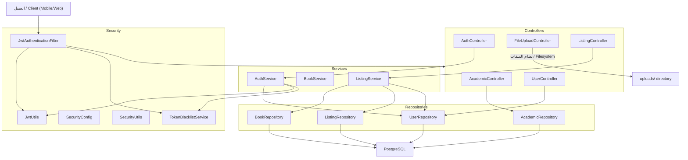

# Waraq — ورق
# Complete Codebase Audit & Refactoring Assessment
# تدقيق شامل للكود وتقييم إعادة الهيكلة

---

## 1. Executive Summary | الملخص التنفيذي

| Dimension / البُعد | Rating / التقييم |
|---|---|
| **Overall Codebase Quality / جودة الكود** | Needs Improvement / يحتاج تحسين |
| **Architecture Quality / جودة الهيكلية** | Acceptable (early-stage) / مقبولة (مرحلة مبكرة) |
| **Biggest Strengths / أبرز نقاط القوة** | فصل الكتب عن الإعلانات، مصادقة JWT صحيحة، استخدام جيد لـ Kotlin data classes |
| **Biggest Problems / أبرز المشاكل** | مفاتيح سرية مكتوبة بالكود، دوال مكررة بالـ Repository، اختبارات معطلة، رفع ملفات بدون مصادقة، قائمة سوداء للتوكنات في الذاكرة فقط |
| **Overall Technical Debt / الدين التقني** | Moderate / متوسط |
| **Overall Refactoring Necessity / ضرورة إعادة الهيكلة** | Moderate — targeted fixes, not a rewrite / متوسطة — إصلاحات مستهدفة وليس إعادة كتابة |

**Overall Assessment: Needs Improvement**
**التقييم العام: يحتاج تحسين**

**EN:** This is an early-stage Spring Boot + Kotlin backend for **Waraq (ورق)** — a marketplace for buying, selling, and exchanging books, targeting **the general public as well as university students** in Jordan. The core architecture (Controller → Service → Repository → DB) is sound and consistently followed. However, there are **critical security issues** (hardcoded JWT secret, database credentials in version control, unauthenticated file uploads), **duplicate query methods** in the repository layer, **stale/broken tests** that reference a previous data model, and several missing features (no update/delete for listings, no pagination metadata). The codebase is small (~38 source files, ~2,200 lines of Kotlin) and the problems are fixable without architectural redesign.

**AR:** هذا مشروع في مراحله الأولى مبني بـ Spring Boot + Kotlin لمنصة **ورق (Waraq)** — سوق لبيع وشراء وتبادل الكتب، يستهدف **العامة بالإضافة لطلاب الجامعات** في الأردن. الهيكلية الأساسية (Controller → Service → Repository → DB) سليمة ومتبعة بشكل ثابت. لكن توجد **مشاكل أمنية حرجة** (مفتاح JWT ثابت بالكود، بيانات قاعدة البيانات محفوظة في نظام التحكم بالإصدارات، رفع ملفات بدون مصادقة)، **دوال بحث مكررة** في طبقة الـ Repository، **اختبارات معطلة** تشير لنموذج بيانات قديم، وعدة ميزات ناقصة. حجم الكود صغير (~38 ملف مصدري، ~2,200 سطر Kotlin) والمشاكل قابلة للإصلاح بدون إعادة تصميم معماري.

---

## 2. Project Overview | نظرة عامة على المشروع

### What the Project Does | ماذا يفعل المشروع

**EN:** **Waraq (ورق)** is a REST API backend for a book marketplace where **the general public and university students** in Jordan can buy, sell, and exchange books. It supports:
- User registration & login (JWT-based)
- Creating book listings (academic books tied to university/faculty/major, or general books/novels for anyone)
- Searching/filtering listings by category, university, faculty, major, price, etc.
- File upload for book cover images
- Academic hierarchy lookup (universities → faculties → majors)

**AR:** **ورق (Waraq)** هو واجهة برمجة تطبيقات (REST API) لسوق كتب حيث يمكن لـ**العامة وطلاب الجامعات** في الأردن بيع وشراء وتبادل الكتب. يدعم:
- تسجيل المستخدمين وتسجيل الدخول (مبني على JWT)
- إنشاء إعلانات كتب (كتب أكاديمية مرتبطة بجامعة/كلية/تخصص، أو كتب عامة/روايات لأي شخص)
- البحث والتصفية حسب التصنيف، الجامعة، الكلية، التخصص، السعر، إلخ
- رفع صور أغلفة الكتب
- استعراض التسلسل الأكاديمي (جامعات ← كليات ← تخصصات)

### Main Technologies | التقنيات الرئيسية
| Technology / التقنية | Version / الإصدار | Purpose / الغرض |
|---|---|---|
| Kotlin | 2.3.21 | اللغة الرئيسية / Primary language |
| Spring Boot | 4.1.0 | إطار العمل / Application framework |
| Spring Data JDBC | (managed) | طبقة الاستمرارية / Primary persistence |
| Spring Security | (managed) | المصادقة / Authentication |
| PostgreSQL | 15 (Alpine) | قاعدة البيانات / Database |
| JJWT | 0.11.5 | توليد وتحقق JWT / JWT token generation/validation |
| BCrypt | (Spring) | تشفير كلمات المرور / Password hashing |
| Gradle (Kotlin DSL) | wrapper | نظام البناء / Build system |
| Docker Compose | — | حاوية PostgreSQL المحلية / Local PostgreSQL container |

### Entry Point | نقطة الدخول
- [WaraqaApplication.kt](file:///c:/Users/USER/CodeReview/Waraqa/src/main/kotlin/com/waraqa/backend/WaraqaApplication.kt) — Spring Boot main class مع `@EnableJdbcRepositories`

### Main Modules | الوحدات الرئيسية
| Package / الحزمة | Purpose / الغرض |
|---|---|
| `controller` | نقاط API النهائية (5 controllers) / REST API endpoints |
| `service` | منطق الأعمال (3 services) / Business logic |
| `repository` | الوصول للبيانات (4 repositories) / Data access |
| `model` | كيانات النطاق (4 ملفات) / Domain entities |
| `dto` | كائنات نقل البيانات (10 DTOs) / Request/response DTOs |
| `exception` | استثناءات مخصصة + معالج عام (5 ملفات) / Custom exceptions + global handler |
| `security` | فلتر JWT، أدوات، تكوين، قائمة سوداء (5 ملفات) / JWT filter, utils, config, blacklist |
| `config` | تكوين الويب/الموارد الثابتة (ملف واحد) / Web/static resource config |

---

## 3. Architecture Overview | نظرة عامة على الهيكلية

### Actual Architecture | الهيكلية الفعلية

**EN:** The project follows a **standard 3-layer Spring Boot architecture**.
**AR:** المشروع يتبع **هيكلية Spring Boot القياسية ذات 3 طبقات**.



### Layer Responsibilities | مسؤوليات الطبقات
| Layer / الطبقة | Responsibility / المسؤولية | Status / الحالة |
|---|---|---|
| **Controllers** | معالجة HTTP، تحليل الطلبات، تنسيق الاستجابات | نظيفة غالباً مع بعض المشاكل الصغيرة |
| **Services** | منطق الأعمال، التحقق، التنسيق | `ListingService` هو الأساسي؛ `BookService` غير مستخدم |
| **Repositories** | استعلامات SQL، ربط البيانات | خليط من JDBC template و Spring Data CRUD؛ يوجد تكرار |
| **Security** | مصادقة JWT، CORS، حماية المسارات | يعمل لكن فيه مفاتيح ثابتة |
| **Models** | ربط كيانات JDBC | Kotlin data classes نظيفة |
| **DTOs** | عقود API | معقولة مع بعض التداخل |

### Architectural Observations | ملاحظات معمارية

**EN:**
1. **Mixed persistence approach**: `UserRepository` extends `CrudRepository` (auto-generated queries), while `BookRepository`, `ListingRepository`, and `AcademicRepository` use manual `NamedParameterJdbcTemplate`. Inconsistent but not necessarily wrong — the manual repos need complex queries.
2. **No service layer for some controllers**: `AcademicController` calls `AcademicRepository` directly. `UserController` calls `UserRepository` directly.
3. **No JPA despite the dependency**: `spring-boot-starter-data-jpa` is in `build.gradle.kts` but the project uses Spring Data JDBC exclusively. JPA is unused.

**AR:**
1. **نهج استمرارية مختلط**: `UserRepository` يستخدم `CrudRepository` (استعلامات تلقائية)، بينما `BookRepository` و`ListingRepository` و`AcademicRepository` تستخدم `NamedParameterJdbcTemplate` يدوياً. غير متسق لكن ليس بالضرورة خطأ — الـ repositories اليدوية تحتاج استعلامات معقدة.
2. **بعض الـ Controllers بدون طبقة Service**: `AcademicController` يستدعي `AcademicRepository` مباشرة. `UserController` يستدعي `UserRepository` مباشرة.
3. **JPA موجود كاعتماد لكن غير مستخدم**: `spring-boot-starter-data-jpa` موجود بـ `build.gradle.kts` لكن المشروع يستخدم Spring Data JDBC حصراً.

---

## 4. Complete File Inventory | جرد الملفات الكامل

### Configuration & Build Files | ملفات الإعداد والبناء

| File / الملف | Type / النوع | Purpose / الغرض | Issues / المشاكل | Refactoring / إعادة الهيكلة | Priority / الأولوية |
|---|---|---|---|---|---|
| [build.gradle.kts](file:///c:/Users/USER/CodeReview/Waraqa/build.gradle.kts) | بناء / Build | تكوين Gradle والاعتمادات | اعتماد `data-jpa` غير مستخدم؛ `data-jdbc` و `data-jpa` معاً | إزالة اعتماد JPA | P3 |
| [settings.gradle.kts](file:///c:/Users/USER/CodeReview/Waraqa/settings.gradle.kts) | بناء / Build | اسم المشروع الجذري | لا توجد مشاكل | لا يحتاج | — |
| [docker-compose.yml](file:///c:/Users/USER/CodeReview/Waraqa/docker-compose.yml) | بنية تحتية / Infra | حاوية PostgreSQL 15 | كلمة مرور ثابتة `password123` | استخدام متغيرات بيئة | P2 |
| [application.yaml](file:///c:/Users/USER/CodeReview/Waraqa/src/main/resources/application.yaml) | إعداد / Config | اتصال قاعدة البيانات، وضع تهيئة SQL | **بيانات الاعتماد ثابتة ومحفوظة في VCS**؛ غير مضاف لـ .gitignore | **يجب إضافته لـ .gitignore واستخدام متغيرات بيئة** | **P0** |
| [application.yml.example](file:///c:/Users/USER/CodeReview/Waraqa/src/main/resources/application.yml.example) | إعداد / Config | قالب تكوين نموذجي | ينقصه إعداد JWT secret | إضافة placeholder لـ JWT | P3 |
| [schema.sql](file:///c:/Users/USER/CodeReview/Waraqa/src/main/resources/schema.sql) | قاعدة بيانات / DB | مخطط + بيانات أولية (جامعات، كليات، تخصصات) | `mode: always` يعيد التشغيل كل مرة؛ البيانات الأولية مخلوطة مع المخطط | فصل البيانات الأولية؛ استخدام أداة migration | P2 |
| [.gitignore](file:///c:/Users/USER/CodeReview/Waraqa/.gitignore) | إعداد / Config | قواعد تجاهل Git | ينقصه `application.yaml` ومجلد `uploads/` | إضافة الملفات الحساسة | **P0** |
| [README.md](file:///c:/Users/USER/CodeReview/Waraqa/README.md) | توثيق / Docs | تعليمات الإعداد | بسيط جداً؛ لا يوجد توثيق API | تحسين التوثيق | P3 |

### Application Entry | نقطة دخول التطبيق

| File / الملف | Purpose / الغرض | Issues / المشاكل |
|---|---|---|
| [WaraqaApplication.kt](file:///c:/Users/USER/CodeReview/Waraqa/src/main/kotlin/com/waraqa/backend/WaraqaApplication.kt) | Spring Boot main class | لا توجد مشاكل مهمة / No significant issues |

### Controllers | المتحكمات

| File / الملف | Purpose / الغرض | Issues / المشاكل | Priority / الأولوية |
|---|---|---|---|
| [AuthController.kt](file:///c:/Users/USER/CodeReview/Waraqa/src/main/kotlin/com/waraqa/backend/controller/AuthController.kt) | تسجيل، دخول، خروج / Register, Login, Logout | معالج استثناءات محلي يكرر العام؛ تنسيق استجابة غير متسق بين login و register | P2 |
| [ListingController.kt](file:///c:/Users/USER/CodeReview/Waraqa/src/main/kotlin/com/waraqa/backend/controller/ListingController.kt) | إنشاء + بحث إعلانات / Create + search listings | imports مكررة؛ نقاط نهائية ناقصة (GET by ID, PUT, DELETE) | P2 |
| [AcademicController.kt](file:///c:/Users/USER/CodeReview/Waraqa/src/main/kotlin/com/waraqa/backend/controller/AcademicController.kt) | بحث جامعات/كليات/تخصصات / University/faculty/major lookup | يستدعي repository مباشرة (بدون service) — مقبول للقراءة فقط | — |
| [FileUploadController.kt](file:///c:/Users/USER/CodeReview/Waraqa/src/main/kotlin/com/waraqa/backend/controller/FileUploadController.kt) | رفع صور / Image upload | **URL ثابت `localhost:8080`**؛ لا يوجد حد لحجم الملف؛ لا يحتاج مصادقة | **P1** |
| [UserController.kt](file:///c:/Users/USER/CodeReview/Waraqa/src/main/kotlin/com/waraqa/backend/controller/UserController.kt) | ملف المستخدم / User profile | يستدعي repository مباشرة؛ `ResponseEntity<Any>` غير محدد النوع | P3 |

### DTOs | كائنات نقل البيانات

| File / الملف | Purpose / الغرض | Issues / المشاكل | Priority / الأولوية |
|---|---|---|---|
| [RegisterRequest.kt](file:///c:/Users/USER/CodeReview/Waraqa/src/main/kotlin/com/waraqa/backend/dto/RegisterRequest.kt) | مدخلات التسجيل / Registration input | جيد — annotations تحقق و JSON aliases | — |
| [LoginRequest.kt](file:///c:/Users/USER/CodeReview/Waraqa/src/main/kotlin/com/waraqa/backend/dto/LoginRequest.kt) | مدخلات الدخول / Login input | لا يوجد `@NotBlank` على email/password | P3 |
| [AuthResponse.kt](file:///c:/Users/USER/CodeReview/Waraqa/src/main/kotlin/com/waraqa/backend/dto/AuthResponse.kt) | استجابة الدخول مع token / Login response | لا توجد مشاكل مهمة | — |
| [CreateListingRequest.kt](file:///c:/Users/USER/CodeReview/Waraqa/src/main/kotlin/com/waraqa/backend/dto/CreateListingRequest.kt) | مدخلات إنشاء إعلان / Listing creation input | بدون validation annotations (التحقق يدوي بالـ service) — مقبول | — |
| [ListingResponseDto.kt](file:///c:/Users/USER/CodeReview/Waraqa/src/main/kotlin/com/waraqa/backend/dto/ListingResponseDto.kt) | مخرجات الإعلان / Listing output | لا توجد مشاكل مهمة | — |
| [CreateBookRequest.kt](file:///c:/Users/USER/CodeReview/Waraqa/src/main/kotlin/com/waraqa/backend/dto/CreateBookRequest.kt) | مدخلات إنشاء كتاب / Book creation input | **يُشتبه أنه غير مستخدم** — لا يوجد endpoint يستهلكه | P2 |
| [UpdateBookRequest.kt](file:///c:/Users/USER/CodeReview/Waraqa/src/main/kotlin/com/waraqa/backend/dto/UpdateBookRequest.kt) | مدخلات تحديث كتاب / Book update input | **يُشتبه أنه غير مستخدم** — لا يوجد endpoint يستهلكه | P2 |
| [BookResponseDto.kt](file:///c:/Users/USER/CodeReview/Waraqa/src/main/kotlin/com/waraqa/backend/dto/BookResponseDto.kt) | مخرجات كتالوج الكتب / Book catalog output | **يُشتبه أنه غير مستخدم** — لم يتم إنشاؤه في أي مكان | P2 |
| [BookDetailDto.kt](file:///c:/Users/USER/CodeReview/Waraqa/src/main/kotlin/com/waraqa/backend/dto/BookDetailDto.kt) | عرض تفصيلي للكتاب مع بيانات البائع / Detailed book view with seller info | **يُشتبه أنه غير مستخدم** — لا service/controller ينشئه | P2 |
| [UserProfileResponse.kt](file:///c:/Users/USER/CodeReview/Waraqa/src/main/kotlin/com/waraqa/backend/dto/UserProfileResponse.kt) | مخرجات ملف المستخدم / User profile output | لا توجد مشاكل مهمة | — |

### Models | النماذج

| File / الملف | Purpose / الغرض | Issues / المشاكل | Priority / الأولوية |
|---|---|---|---|
| [User.kt](file:///c:/Users/USER/CodeReview/Waraqa/src/main/kotlin/com/waraqa/backend/model/User.kt) | كيان المستخدم / User entity | كلمة المرور مخزنة بالنموذج (تظهر بكل السياقات) | P3 |
| [Book.kt](file:///c:/Users/USER/CodeReview/Waraqa/src/main/kotlin/com/waraqa/backend/model/Book.kt) | كيان كتالوج الكتب / Book catalog entity | نظيف؛ لا توجد مشاكل مهمة | — |
| [Listing.kt](file:///c:/Users/USER/CodeReview/Waraqa/src/main/kotlin/com/waraqa/backend/model/Listing.kt) | كيان الإعلان (بيع/تبادل) / Listing entity | نظيف؛ column mappings صحيحة | — |
| [AcademicLookup.kt](file:///c:/Users/USER/CodeReview/Waraqa/src/main/kotlin/com/waraqa/backend/model/AcademicLookup.kt) | جامعة، كلية، تخصص / University, Faculty, Major | data classes بسيطة — جيدة للقراءة فقط | — |

### Repositories | المستودعات

| File / الملف | Purpose / الغرض | Issues / المشاكل | Priority / الأولوية |
|---|---|---|---|
| [UserRepository.kt](file:///c:/Users/USER/CodeReview/Waraqa/src/main/kotlin/com/waraqa/backend/repository/UserRepository.kt) | CRUD للمستخدمين (Spring Data) | يستخدم `CrudRepository` بينما الباقي يستخدم JDBC template — غير متسق لكن يعمل | — |
| [BookRepository.kt](file:///c:/Users/USER/CodeReview/Waraqa/src/main/kotlin/com/waraqa/backend/repository/BookRepository.kt) | CRUD للكتب (JDBC template) | `findAll()` يستخدم RowMapper مختلف ينقصه حقل `edition`؛ رسالة خطأ بالعربي بـ `save()` | P2 |
| [ListingRepository.kt](file:///c:/Users/USER/CodeReview/Waraqa/src/main/kotlin/com/waraqa/backend/repository/ListingRepository.kt) | CRUD + بحث إعلانات (JDBC template) | **`findListings()` و `findListingsWithFilters()` دوال مكررة**؛ `findListingsWithFilters` يستخدم RowMapper مختلف **ينقصه `imagesUrl`، `viewsCount`، `savesCount`، `publishedAt`**؛ parameter `subType` لا يُستخدم بالاستعلام | **P1** |
| [AcademicRepository.kt](file:///c:/Users/USER/CodeReview/Waraqa/src/main/kotlin/com/waraqa/backend/repository/AcademicRepository.kt) | بحث جامعات/كليات/تخصصات (JDBC template) | نظيف؛ استعلامات مُعَلّمة صحيحة | — |

### Services | الخدمات

| File / الملف | Purpose / الغرض | Issues / المشاكل | Priority / الأولوية |
|---|---|---|---|
| [AuthService.kt](file:///c:/Users/USER/CodeReview/Waraqa/src/main/kotlin/com/waraqa/backend/service/AuthService.kt) | تسجيل، دخول، خروج / Registration, login, logout | `RegistrationException` مُعرّف داخل ملف الـ service بدل حزمة exception؛ `clearContext()` بلا فائدة | P3 |
| [BookService.kt](file:///c:/Users/USER/CodeReview/Waraqa/src/main/kotlin/com/waraqa/backend/service/BookService.kt) | عمليات كتالوج الكتب / Book catalog operations | **غير مستخدم** — 3 دوال، لا يتم استدعاء أي منها من أي controller | P2 |
| [ListingService.kt](file:///c:/Users/USER/CodeReview/Waraqa/src/main/kotlin/com/waraqa/backend/service/ListingService.kt) | إنشاء + بحث إعلانات / Create + search listings | **مشكلة N+1** بـ `getListings()`؛ يستخدم `SecurityContextHolder` مباشرة بدل `SecurityUtils`؛ دالة `createListing` كبيرة (~107 أسطر) | **P1** |

### Security | الأمان

| File / الملف | Purpose / الغرض | Issues / المشاكل | Priority / الأولوية |
|---|---|---|---|
| [SecurityConfig.kt](file:///c:/Users/USER/CodeReview/Waraqa/src/main/kotlin/com/waraqa/backend/security/SecurityConfig.kt) | سلسلة الفلاتر، CORS، قواعد المسارات | CORS يسمح فقط بـ localhost؛ endpoint الرفع عام (بدون مصادقة) | P1 |
| [JwtUtils.kt](file:///c:/Users/USER/CodeReview/Waraqa/src/main/kotlin/com/waraqa/backend/security/JwtUtils.kt) | توليد/تحقق التوكن / Token generation/validation | **مفتاح JWT ثابت بالكود المصدري** | **P0** |
| [JwtAuthenticationFilter.kt](file:///c:/Users/USER/CodeReview/Waraqa/src/main/kotlin/com/waraqa/backend/security/JwtAuthenticationFilter.kt) | استخلاص JWT من الـ header | تنفيذ نظيف | — |
| [SecurityUtils.kt](file:///c:/Users/USER/CodeReview/Waraqa/src/main/kotlin/com/waraqa/backend/security/SecurityUtils.kt) | الحصول على email/ID المستخدم الحالي | `getCurrentUserId()` يعمل استعلام DB كل مرة — غير مُخَزَّن مؤقتاً | P3 |
| [TokenBlacklistService.kt](file:///c:/Users/USER/CodeReview/Waraqa/src/main/kotlin/com/waraqa/backend/security/TokenBlacklistService.kt) | قائمة سوداء بالذاكرة / In-memory blacklist | **القائمة تُفقد عند إعادة التشغيل**؛ تنمو بلا حدود (تسرب ذاكرة) | **P1** |

### Exceptions | الاستثناءات

| File / الملف | Purpose / الغرض | Issues / المشاكل | Priority / الأولوية |
|---|---|---|---|
| [GlobalExceptionHandler.kt](file:///c:/Users/USER/CodeReview/Waraqa/src/main/kotlin/com/waraqa/backend/exception/GlobalExceptionHandler.kt) | ربط استثناءات بـ HTTP responses | رسالة ثابتة "Book not found"؛ لا يعالج `BadCredentialsException` | P2 |
| [BadRequestException.kt](file:///c:/Users/USER/CodeReview/Waraqa/src/main/kotlin/com/waraqa/backend/exception/BadRequestException.kt) | 400 Bad Request | **يُشتبه أنه غير مستخدم** — لا يُرمى في أي مكان | P3 |
| [ForbiddenException.kt](file:///c:/Users/USER/CodeReview/Waraqa/src/main/kotlin/com/waraqa/backend/exception/ForbiddenException.kt) | 403 Forbidden | مستخدم بـ `ListingService.createListing()` | — |
| [NotFoundException.kt](file:///c:/Users/USER/CodeReview/Waraqa/src/main/kotlin/com/waraqa/backend/exception/NotFoundException.kt) | 404 Not Found | مستخدم بـ `BookService` | — |
| [ValidationException.kt](file:///c:/Users/USER/CodeReview/Waraqa/src/main/kotlin/com/waraqa/backend/exception/ValidationException.kt) | خريطة أخطاء التحقق / Validation errors map | مستخدم بـ `ListingService` | — |

### Config | الإعداد

| File / الملف | Purpose / الغرض | Issues / المشاكل |
|---|---|---|
| [WebConfig.kt](file:///c:/Users/USER/CodeReview/Waraqa/src/main/kotlin/com/waraqa/backend/config/WebConfig.kt) | تقديم الملفات المرفوعة كموارد ثابتة | لا توجد مشاكل مهمة |

### Tests | الاختبارات

| File / الملف | Purpose / الغرض | Issues / المشاكل | Priority / الأولوية |
|---|---|---|---|
| [WaraqaApplicationTests.kt](file:///c:/Users/USER/CodeReview/Waraqa/src/test/kotlin/com/waraqa/backend/WaraqaApplicationTests.kt) | اختبار تحميل السياق / Context load smoke test | يحتاج PostgreSQL يكون شغال | — |
| [SecurityTest.kt](file:///c:/Users/USER/CodeReview/Waraqa/src/test/kotlin/com/waraqa/backend/SecurityTest.kt) | اختبار تكاملي لتدفق المصادقة + القائمة السوداء | يحتاج PostgreSQL؛ بنية جيدة | — |
| [BookRepositoryTest.kt](file:///c:/Users/USER/CodeReview/Waraqa/src/test/kotlin/com/waraqa/backend/repository/BookRepositoryTest.kt) | اختبار حفظ/استرجاع كتاب | **معطل** — يشير لخصائص `Book.price`، `Book.publishedAt`، `Book.coverImage`، `Book.publisherId` و دالة `findByPublisherId()` التي **لا توجد** بالنموذج الحالي | **P1** |

---

## 5. Main Application Flows | تدفقات التطبيق الرئيسية

### Flow 1: User Registration | تسجيل المستخدم
```
Client POST /api/auth/register
  → JwtAuthenticationFilter (يمر — endpoint عام)
  → SecurityConfig (permitAll لـ /api/auth/**)
  → AuthController.register()
    → @Valid يتحقق من RegisterRequest (الاسم، الإيميل، كلمة المرور، الهاتف)
    → AuthService.register()
      → UserRepository.existsByEmail() — فحص التكرار
      → UserRepository.existsByPhoneNumber() — فحص التكرار
      → PasswordEncoder.encode() — تشفير كلمة المرور
      → UserRepository.save() — حفظ المستخدم
  → يُرجع 201 {success: true, message: "Registration successful"}
```

### Flow 2: User Login | تسجيل الدخول
```
Client POST /api/auth/login
  → AuthController.login()
    → AuthService.login()
      → UserRepository.findByEmail()
      → PasswordEncoder.matches() — التحقق من كلمة المرور
      → JwtUtils.generateToken() — إنشاء JWT
  → يُرجع 200 AuthResponse {token, userId, name, email, phoneNumber}
```

### Flow 3: Create Listing (Authenticated) | إنشاء إعلان (يحتاج مصادقة)
```
Client POST /listings (مع Authorization: Bearer <token>)
  → JwtAuthenticationFilter
    → JwtUtils.validateToken()
    → TokenBlacklistService.isBlacklisted()
    → يُعيّن SecurityContext مع email كـ principal
  → ListingController.createListing()
    → ListingService.createListing()
      → SecurityContextHolder → يحصل على email المستخدم
      → UserRepository.findByEmail() → يحصل على ID المستخدم
      → تحقق يدوي (عنوان، صورة، تصنيف، سعر، حالة، إلخ)
      → BookRepository.findByTitleAndAuthor() — إعادة استخدام كتاب موجود أو إنشاء جديد
      → BookRepository.save() — إذا كتاب جديد
      → ListingRepository.save() — إنشاء إعلان مربوط بالكتاب
  → يُرجع 201 ListingResponseDto
```

### Flow 4: Search Listings (Public) | بحث الإعلانات (عام)
```
Client GET /listings?search=X&category=Y&university_id=Z&sort=newest&page=0&limit=8
  → ListingController.getListings()
    → ListingService.getListings()
      → ListingRepository.findListingsWithFilters() — استعلام SQL JOIN
      → ⚠️ لكل إعلان: BookRepository.findById() — مشكلة N+1
      → يُحوّل لـ List<ListingResponseDto>
  → يُرجع 200 List<ListingResponseDto>
```

### Flow 5: Academic Lookup (Public) | البحث الأكاديمي (عام)
```
Client GET /api/universities
  → AcademicController.getUniversities()
    → AcademicRepository.findAllUniversities()
  → يُرجع 200 List<University>

Client GET /api/faculties?university_id=1
  → AcademicController.getFaculties()
    → AcademicRepository.findFaculties(universityId=1)
  → يُرجع 200 List<Faculty>
```

### Flow 6: File Upload (Public — NO AUTH) | رفع ملف (عام — بدون مصادقة)
```
Client POST /api/upload (multipart file)
  → FileUploadController.uploadFile()
    → يتحقق أنه غير فارغ + نوع image
    → يولّد اسم UUID
    → يحفظ بنظام الملفات uploads/
  → يُرجع 200 {url: "http://localhost:8080/uploads/<uuid>.ext"}
```

---

## 6. Findings by Category | النتائج حسب الفئة

### 6.1 Architecture | الهيكلية

| Severity / الخطورة | Finding / النتيجة | Location / الموقع | Recommendation / التوصية |
|---|---|---|---|
| متوسط / Medium | أنماط استمرارية مختلطة (CrudRepository مع JdbcTemplate) | `UserRepository` مقابل الباقي | مقبول — يُوَثّق النمط |
| منخفض / Low | بعض الـ controllers تتجاوز طبقة الـ service | `AcademicController`، `UserController` | مقبول لعمليات القراءة البسيطة |
| متوسط / Medium | اعتماد JPA غير مستخدم | [build.gradle.kts:23](file:///c:/Users/USER/CodeReview/Waraqa/build.gradle.kts#L23) | إزالة `spring-boot-starter-data-jpa` |
| منخفض / Low | `RegistrationException` مُعرّف بملف `AuthService.kt` بدل حزمة `exception` | [AuthService.kt:15-18](file:///c:/Users/USER/CodeReview/Waraqa/src/main/kotlin/com/waraqa/backend/service/AuthService.kt#L15-L18) | نقله لحزمة exception |

### 6.2 Business Logic | منطق الأعمال

| Severity / الخطورة | Finding / النتيجة | Location / الموقع | Recommendation / التوصية |
|---|---|---|---|
| **عالي / High** | **مشكلة N+1** بـ `getListings()` — كل إعلان يستعلم عن كتابه بشكل فردي | [ListingService.kt:156](file:///c:/Users/USER/CodeReview/Waraqa/src/main/kotlin/com/waraqa/backend/service/ListingService.kt#L156) | إنشاء استعلام JOIN يُرجع بيانات الإعلان والكتاب معاً |
| متوسط / Medium | `createListing()` دالة 107 سطر تخلط التحقق مع الاستمرارية | [ListingService.kt:24-131](file:///c:/Users/USER/CodeReview/Waraqa/src/main/kotlin/com/waraqa/backend/service/ListingService.kt#L24-L131) | استخلاص التحقق لدالة منفصلة |
| متوسط / Medium | `ListingService` يستخدم `SecurityContextHolder` مباشرة بدل `SecurityUtils` | [ListingService.kt:26](file:///c:/Users/USER/CodeReview/Waraqa/src/main/kotlin/com/waraqa/backend/service/ListingService.kt#L26) | حقن واستخدام `SecurityUtils` للتناسق |
| متوسط / Medium | `BookService` موجود لكن لا يُستدعى من أي controller | [BookService.kt](file:///c:/Users/USER/CodeReview/Waraqa/src/main/kotlin/com/waraqa/backend/service/BookService.kt) | ربطه بـ controller أو إزالته |
| منخفض / Low | `AuthService.logout()` يستدعي `SecurityContextHolder.clearContext()` بلا فائدة في JWT stateless | [AuthService.kt:69](file:///c:/Users/USER/CodeReview/Waraqa/src/main/kotlin/com/waraqa/backend/service/AuthService.kt#L69) | إزالة الاستدعاء |

### 6.3 API | واجهة البرمجة

| Severity / الخطورة | Finding / النتيجة | Location / الموقع | Recommendation / التوصية |
|---|---|---|---|
| متوسط / Medium | بادئات مسار API غير متسقة: `/api/auth`، `/api`، `/listings` (بدون `/api`) | [ListingController.kt:15](file:///c:/Users/USER/CodeReview/Waraqa/src/main/kotlin/com/waraqa/backend/controller/ListingController.kt#L15) | توحيد لـ `/api/listings` |
| متوسط / Medium | تنسيقات استجابة غير متسقة: register يُرجع `{success, message}`، login يُرجع `AuthResponse` مباشرة | عدة controllers | تعريف غلاف استجابة موحد |
| متوسط / Medium | `AuthController` لديه `@ExceptionHandler` محلي يتنافس مع `GlobalExceptionHandler` | [AuthController.kt:52-76](file:///c:/Users/USER/CodeReview/Waraqa/src/main/kotlin/com/waraqa/backend/controller/AuthController.kt#L52-L76) | نقله لـ GlobalExceptionHandler |
| منخفض / Low | نقاط نهائية ناقصة: لا يوجد GET `/listings/{id}`، لا PUT/DELETE للإعلانات | `ListingController` | إضافتها عند الحاجة |
| منخفض / Low | لا يوجد معلومات صفحات (عدد كلي، إجمالي الصفحات) | `ListingController.getListings()` | إضافة غلاف pagination |

### 6.4 Database | قاعدة البيانات

| Severity / الخطورة | Finding / النتيجة | Location / الموقع | Recommendation / التوصية |
|---|---|---|---|
| **عالي / High** | **دوال استعلام مكررة**: `findListings()` و `findListingsWithFilters()` بـ `ListingRepository` تعمل نفس الشيء تقريباً | [ListingRepository.kt:95-211](file:///c:/Users/USER/CodeReview/Waraqa/src/main/kotlin/com/waraqa/backend/repository/ListingRepository.kt#L95-L211) | إزالة `findListings()`؛ إصلاح `findListingsWithFilters()` |
| **عالي / High** | `findListingsWithFilters()` يستخدم RowMapper مُضمّن **ينقصه** حقول `imagesUrl`، `viewsCount`، `savesCount`، `publishedAt` | [ListingRepository.kt:195-210](file:///c:/Users/USER/CodeReview/Waraqa/src/main/kotlin/com/waraqa/backend/repository/ListingRepository.kt#L195-L210) | استخدام الـ `rowMapper` على مستوى الكلاس |
| متوسط / Medium | `findListingsWithFilters()` يقبل parameter `subType` لكن **لا يستخدمه بالـ SQL** | [ListingRepository.kt:149](file:///c:/Users/USER/CodeReview/Waraqa/src/main/kotlin/com/waraqa/backend/repository/ListingRepository.kt#L149) | إما تطبيق الفلتر أو إزالة الـ parameter |
| متوسط / Medium | `BookRepository.findAll()` يستخدم RowMapper مُضمّن **ينقصه** حقل `edition` | [BookRepository.kt:71-82](file:///c:/Users/USER/CodeReview/Waraqa/src/main/kotlin/com/waraqa/backend/repository/BookRepository.kt#L71-L82) | استخدام الـ `rowMapper` على مستوى الكلاس |
| منخفض / Low | لا يوجد index على `listings.book_id` رغم أنه FK مستخدم بالـ JOINs | [schema.sql](file:///c:/Users/USER/CodeReview/Waraqa/src/main/resources/schema.sql) | إضافة `CREATE INDEX IF NOT EXISTS idx_listings_book_id ON listings(book_id)` |

### 6.5 Security | الأمان

| Severity / الخطورة | Finding / النتيجة | Location / الموقع | Recommendation / التوصية |
|---|---|---|---|
| **حرج / Critical** | **مفتاح JWT ثابت بالكود**: `"waraqa_dev_secret_key_must_be_at_least_32_bytes_long_123456"` | [JwtUtils.kt:14](file:///c:/Users/USER/CodeReview/Waraqa/src/main/kotlin/com/waraqa/backend/security/JwtUtils.kt#L14) | نقله لـ `application.yaml` / متغير بيئة |
| **حرج / Critical** | **بيانات اعتماد قاعدة البيانات محفوظة بـ VCS**: `password123` بـ `application.yaml` غير مضاف لـ gitignore | [application.yaml:5](file:///c:/Users/USER/CodeReview/Waraqa/src/main/resources/application.yaml#L5) | إضافة `application.yaml` لـ `.gitignore`؛ استخدام متغيرات بيئة |
| **عالي / High** | **endpoint رفع الملفات لا يحتاج مصادقة** — أي شخص يقدر يرفع ملفات على السيرفر | [SecurityConfig.kt:63](file:///c:/Users/USER/CodeReview/Waraqa/src/main/kotlin/com/waraqa/backend/security/SecurityConfig.kt#L63) | طلب مصادقة لـ `/api/upload` |
| **عالي / High** | **القائمة السوداء بالذاكرة** — كل التوكنات المحظورة تُفقد عند إعادة تشغيل السيرفر | [TokenBlacklistService.kt:8](file:///c:/Users/USER/CodeReview/Waraqa/src/main/kotlin/com/waraqa/backend/security/TokenBlacklistService.kt#L8) | الحفظ بـ DB أو Redis |
| **عالي / High** | **القائمة السوداء تنمو بلا حدود** — لا تنظيف TTL، تسرب ذاكرة محتمل | [TokenBlacklistService.kt:8](file:///c:/Users/USER/CodeReview/Waraqa/src/main/kotlin/com/waraqa/backend/security/TokenBlacklistService.kt#L8) | إضافة تنظيف للتوكنات المنتهية |
| متوسط / Medium | **لا يوجد قائمة بيضاء لامتدادات الملفات** عند الرفع — يقبل أي `image/*` MIME type يمكن تزويره | [FileUploadController.kt:30](file:///c:/Users/USER/CodeReview/Waraqa/src/main/kotlin/com/waraqa/backend/controller/FileUploadController.kt#L30) | التحقق من الامتداد + magic bytes |
| متوسط / Medium | **لا يوجد حد لحجم الملف** عند الرفع | [FileUploadController.kt](file:///c:/Users/USER/CodeReview/Waraqa/src/main/kotlin/com/waraqa/backend/controller/FileUploadController.kt) | تكوين `spring.servlet.multipart.max-file-size` |
| متوسط / Medium | **URL رفع ثابت** `http://localhost:8080` — لن يعمل بالإنتاج | [FileUploadController.kt:42](file:///c:/Users/USER/CodeReview/Waraqa/src/main/kotlin/com/waraqa/backend/controller/FileUploadController.kt#L42) | استخدام خاصية تكوين أو `ServletUriComponentsBuilder` |

### 6.6 Code Quality | جودة الكود

| Severity / الخطورة | Finding / النتيجة | Location / الموقع |
|---|---|---|
| متوسط / Medium | رسائل خطأ عربية مخلوطة مع إنجليزية بالـ repositories | [BookRepository.kt:40](file:///c:/Users/USER/CodeReview/Waraqa/src/main/kotlin/com/waraqa/backend/repository/BookRepository.kt#L40)، [ListingRepository.kt:76](file:///c:/Users/USER/CodeReview/Waraqa/src/main/kotlin/com/waraqa/backend/repository/ListingRepository.kt#L76) |
| منخفض / Low | تعليق متبقي `// <-- Added missing closing brace here!` | [AuthController.kt:76](file:///c:/Users/USER/CodeReview/Waraqa/src/main/kotlin/com/waraqa/backend/controller/AuthController.kt#L76) |
| منخفض / Low | `MapSqlParameterSource` مكتوب بالاسم الكامل بدل import | [ListingRepository.kt:160](file:///c:/Users/USER/CodeReview/Waraqa/src/main/kotlin/com/waraqa/backend/repository/ListingRepository.kt#L160) |

### 6.7 Testing | الاختبارات

| Severity / الخطورة | Finding / النتيجة | Recommendation / التوصية |
|---|---|---|
| **عالي / High** | **`BookRepositoryTest` معطل** — يشير لخصائص من نموذج Book قديم (`price`، `publishedAt`، `coverImage`، `publisherId`) ودالة `findByPublisherId()` غير موجودة | إعادة كتابة الاختبار للنموذج الحالي أو حذفه |
| متوسط / Medium | لا يوجد اختبارات لـ `ListingService` (أعقد service) | إضافة اختبارات وحدة لمنطق التحقق |
| متوسط / Medium | لا يوجد اختبارات لدوال استعلام `ListingRepository` | إضافة اختبارات تكاملية لاستعلامات البحث |
| منخفض / Low | كل الاختبارات تحتاج PostgreSQL شغال (لا testcontainers أو H2) | إضافة Testcontainers لـ CI |

### 6.8 Dependencies & Configuration | الاعتمادات والتكوين

| Severity / الخطورة | Finding / النتيجة | Recommendation / التوصية |
|---|---|---|
| متوسط / Medium | **اعتماد غير مستخدم**: `spring-boot-starter-data-jpa` — المشروع يستخدم JDBC مش JPA. يسحب Hibernate وكل اعتماداته بدون فائدة | إزالته |
| منخفض / Low | مجلد `uploads/` (30 صورة، ~8MB) محفوظ بـ git | إضافته لـ `.gitignore` |

---

## 7. What Is Already Good | ما هو جيد ولا يحتاج تغيير

> [!TIP]
> **EN:** The following should NOT be unnecessarily refactored.
> **AR:** التالي لا يجب إعادة هيكلته بدون سبب مقنع.

1. **فصل الكتب عن الإعلانات / Book/Listing separation** — قرار تصميمي جيد. جدول `books` لبيانات الكتاب الثابتة، وجدول `listings` لعروض البيع/التبادل. يمنع تكرار بيانات الكتاب عبر الإعلانات.

2. **Kotlin data classes للنماذج والـ DTOs** — نظيفة، اصطلاحية Kotlin. غير قابلة للتعديل (immutable)، مختصرة.

3. **تحقق `RegisterRequest`** — استخدام جيد لـ `@NotBlank`، `@Email`، `@Pattern` مع رسائل واضحة و `@JsonAlias` لمرونة الإدخال.

4. **تدفق مصادقة JWT** — `JwtAuthenticationFilter` → `JwtUtils` → `SecurityConfig` مُهيكل جيداً، يتبع أنماط Spring Security بشكل صحيح.

5. **`AcademicRepository`** — نظيف، منظم، استعلامات مُعَلّمة صحيحة وRowMappers متسقة.

6. **`SecurityTest`** — اختبار تكاملي جيد البنية يغطي endpoints العامة، الوصول المصادق، وتعطيل التوكن بعد الخروج.

7. **تصميم المخطط (schema)** — استخدام صحيح للمفاتيح الأجنبية، القيود (`UNIQUE`، `NOT NULL`)، الفهارس، و `ON CONFLICT` لبيانات أولية متكررة الإدخال.

8. **منطق التحقق بـ `ListingService.createListing()`** — تحقق شامل من متطلبات كل تصنيف (أكاديمي مقابل عام)، قيود نوع الإعلان، وقواعد السعر.

9. **`WebConfig` static resource handler** — تنفيذ بسيط وصحيح لتقديم الملفات المرفوعة.

10. **تفويض مسارات `SecurityConfig`** — فصل واضح بين endpoints العامة والمحمية.

---

## 8. Refactoring Candidates | مرشحات إعادة الهيكلة

### P0 — حرج / Critical (يجب الإصلاح فوراً / Must Fix Immediately)

| # | File(s) / الملفات | Problem / المشكلة | Proposed Change / التغيير المقترح | Risk / المخاطر | Complexity / التعقيد |
|---|---|---|---|---|---|
| 1 | [JwtUtils.kt](file:///c:/Users/USER/CodeReview/Waraqa/src/main/kotlin/com/waraqa/backend/security/JwtUtils.kt) | مفتاح JWT ثابت بالكود / Hardcoded JWT secret | نقله لـ `application.yaml` كـ `jwt.secret`؛ حقنه بـ `@Value` | منخفض — التوكنات الحالية ستُبطل إذا تغير المفتاح | صغير / Small |
| 2 | [application.yaml](file:///c:/Users/USER/CodeReview/Waraqa/src/main/resources/application.yaml)، [.gitignore](file:///c:/Users/USER/CodeReview/Waraqa/.gitignore) | بيانات اعتماد DB محفوظة بـ VCS | إضافة `application.yaml` و `uploads/` لـ `.gitignore`؛ استخدام `application.yml.example` كقالب | منخفض — المطورون يحتاجون إعادة إنشاء الإعداد المحلي | صغير / Small |

### P1 — عالي / High

| # | File(s) / الملفات | Problem / المشكلة | Proposed Change / التغيير المقترح | Risk / المخاطر | Complexity / التعقيد |
|---|---|---|---|---|---|
| 3 | [ListingRepository.kt](file:///c:/Users/USER/CodeReview/Waraqa/src/main/kotlin/com/waraqa/backend/repository/ListingRepository.kt) | دوال `findListings()` / `findListingsWithFilters()` مكررة؛ RowMapper ناقص | إزالة `findListings()`؛ إصلاح `findListingsWithFilters()` لاستخدام `rowMapper` على مستوى الكلاس | منخفض — `findListings` غير مُستدعاة | صغير / Small |
| 4 | [ListingService.kt](file:///c:/Users/USER/CodeReview/Waraqa/src/main/kotlin/com/waraqa/backend/service/ListingService.kt) | مشكلة N+1 بـ `getListings()` — `bookRepository.findById()` لكل إعلان | إنشاء دالة repository تعمل JOIN بين listings+books؛ أو جلب الكتب دفعة واحدة | متوسط — يغير واجهة الـ repository | متوسط / Medium |
| 5 | [TokenBlacklistService.kt](file:///c:/Users/USER/CodeReview/Waraqa/src/main/kotlin/com/waraqa/backend/security/TokenBlacklistService.kt) | القائمة السوداء بالذاكرة تُفقد عند الإعادة؛ لا تنظيف TTL | كحد أدنى: إضافة تنظيف مجدول. المثالي: حفظ بـ DB أو Redis | منخفض | متوسط / Medium |
| 6 | [SecurityConfig.kt](file:///c:/Users/USER/CodeReview/Waraqa/src/main/kotlin/com/waraqa/backend/security/SecurityConfig.kt) | endpoint الرفع يسمح برفع ملفات بدون مصادقة | نقل `/api/upload` للقواعد المصادق عليها | منخفض | صغير / Small |
| 7 | [BookRepositoryTest.kt](file:///c:/Users/USER/CodeReview/Waraqa/src/test/kotlin/com/waraqa/backend/repository/BookRepositoryTest.kt) | الاختبار يشير لخصائص من نموذج Book قديم — لن يعمل compile | إعادة كتابة الاختبار للنموذج الحالي (بدون price, publisherId) | لا شيء — الاختبار معطل أصلاً | صغير / Small |
| 8 | [FileUploadController.kt](file:///c:/Users/USER/CodeReview/Waraqa/src/main/kotlin/com/waraqa/backend/controller/FileUploadController.kt) | URL ثابت `http://localhost:8080` | استخدام `@Value` أو `ServletUriComponentsBuilder` | منخفض | صغير / Small |

### P2 — متوسط / Medium

| # | File(s) / الملفات | Problem / المشكلة | Proposed Change / التغيير المقترح |
|---|---|---|---|
| 9 | [ListingController.kt](file:///c:/Users/USER/CodeReview/Waraqa/src/main/kotlin/com/waraqa/backend/controller/ListingController.kt) | بادئة API غير متسقة (`/listings` مقابل `/api/...`) | تغيير لـ `/api/listings`؛ تحديث SecurityConfig |
| 10 | [build.gradle.kts](file:///c:/Users/USER/CodeReview/Waraqa/build.gradle.kts) | اعتماد `data-jpa` غير مستخدم | إزالة `spring-boot-starter-data-jpa` |
| 11 | [BookRepository.kt](file:///c:/Users/USER/CodeReview/Waraqa/src/main/kotlin/com/waraqa/backend/repository/BookRepository.kt) | `findAll()` RowMapper مُضمّن ينقصه `edition` | استخدام `rowMapper` على مستوى الكلاس |
| 12 | [AuthController.kt](file:///c:/Users/USER/CodeReview/Waraqa/src/main/kotlin/com/waraqa/backend/controller/AuthController.kt) | `@ExceptionHandler` محلي يكرر المعالج العام | نقل معالجة `MethodArgumentNotValidException` لـ `GlobalExceptionHandler` |
| 13 | DTOs: `CreateBookRequest`، `UpdateBookRequest`، `BookResponseDto`، `BookDetailDto` | يُشتبه أنها غير مستخدمة | التحقق؛ الإزالة إذا كانت كود ميت فعلاً |

### P3 — منخفض / Low

| # | File(s) / الملفات | Problem / المشكلة | Proposed Change / التغيير المقترح |
|---|---|---|---|
| 14 | [AuthService.kt](file:///c:/Users/USER/CodeReview/Waraqa/src/main/kotlin/com/waraqa/backend/service/AuthService.kt) | `RegistrationException` مُعرّف بملف الـ service | نقله لحزمة `exception` |
| 15 | [AuthService.kt](file:///c:/Users/USER/CodeReview/Waraqa/src/main/kotlin/com/waraqa/backend/service/AuthService.kt) | `clearContext()` بـ `logout()` بلا فائدة | إزالة الاستدعاء |
| 16 | عدة repositories | رسائل خطأ عربية ("فشل استرجاع الـ ID") | توحيد اللغة |
| 17 | [AuthController.kt:76](file:///c:/Users/USER/CodeReview/Waraqa/src/main/kotlin/com/waraqa/backend/controller/AuthController.kt#L76) | تعليق تصحيح أخطاء: `// <-- Added missing closing brace here!` | إزالته |
| 18 | [LoginRequest.kt](file:///c:/Users/USER/CodeReview/Waraqa/src/main/kotlin/com/waraqa/backend/dto/LoginRequest.kt) | لا يوجد `@NotBlank` على email/password | إضافة تحقق |

---

## 9. Quick Wins | مكاسب سريعة

**EN:** Low-risk, low-effort changes with high benefit.
**AR:** تغييرات منخفضة المخاطر والجهد مع فائدة عالية.

| # | Change / التغيير | Effort / الجهد | Benefit / الفائدة |
|---|---|---|---|
| 1 | إضافة `application.yaml` و `uploads/` لـ `.gitignore` | 2 دقيقة | منع تسريب بيانات الاعتماد |
| 2 | إزالة `findListings()` من `ListingRepository` (مؤكد غير مستخدم) | 5 دقائق | إزالة الارتباك والكود الميت |
| 3 | إصلاح `findListingsWithFilters()` لاستخدام `rowMapper` على مستوى الكلاس | 5 دقائق | إصلاح الحقول المفقودة بنتائج البحث |
| 4 | إصلاح `BookRepository.findAll()` لاستخدام `rowMapper` على مستوى الكلاس | 2 دقيقة | إصلاح حقل `edition` المفقود |
| 5 | إزالة تعليق التصحيح بـ `AuthController` | 1 دقيقة | نظافة الكود |
| 6 | إزالة `clearContext()` من `AuthService.logout()` | 1 دقيقة | إزالة كود مُضلل |
| 7 | حذف أو إعادة كتابة `BookRepositoryTest` | 15 دقيقة | إصلاح الاختبارات المعطلة |
| 8 | إزالة اعتماد JPA غير المستخدم | 2 دقيقة | تقليل حجم البناء ووقت البدء |

---

## 10. Major Refactorings | إعادة هيكلة رئيسية

### Major Refactoring 1: Fix N+1 Query | إصلاح مشكلة N+1
- **الملفات / Files**: `ListingRepository.kt`، `ListingService.kt`
- **المشكلة / Problem**: `getListings()` يستعلم عن كل كتاب بشكل فردي داخل حلقة
- **التغيير / Change**: إنشاء استعلام JOIN يُرجع بيانات الإعلان والكتاب معاً، أو جلب كل الكتب دفعة واحدة بالـ IDs
- **الأثر / Impact**: تحسين أداء البحث عن الإعلانات (الـ endpoint الأكثر استخداماً)
- **التعقيد / Complexity**: متوسط / Medium

### Major Refactoring 2: Externalize All Secrets | إخراج كل المفاتيح السرية
- **الملفات / Files**: `JwtUtils.kt`، `application.yaml`، `docker-compose.yml`، `FileUploadController.kt`
- **المشكلة / Problem**: المفاتيح والقيم الخاصة بالبيئة ثابتة في كل مكان
- **التغيير / Change**: نقل JWT secret، بيانات DB، base URL للتكوين مع تجاوزات متغيرات البيئة
- **الأثر / Impact**: أمان + جاهزية للإنتاج
- **التعقيد / Complexity**: صغير-متوسط / Small-Medium

### Major Refactoring 3: Standardize API Response Format | توحيد تنسيق استجابة API
- **الملفات / Files**: كل الـ controllers
- **المشكلة / Problem**: تنسيقات استجابة غير متسقة
- **التغيير / Change**: إنشاء غلاف `ApiResponse<T>` موحد
- **الأثر / Impact**: عقد API أفضل؛ تطوير عميل أسهل
- **التعقيد / Complexity**: متوسط (يمس كل الـ controllers)

---

## 11. Technical Debt | الدين التقني

### Critical Technical Debt | دين تقني حرج
| Debt / الدين | Location / الموقع | Impact / الأثر | Address Now? / يُعالج الآن؟ |
|---|---|---|---|
| مفتاح JWT ثابت / Hardcoded JWT secret | `JwtUtils.kt` | أي شخص لديه وصول للكود يقدر يزوّر توكنات | **نعم / Yes** |
| بيانات اعتماد بـ VCS / Credentials in VCS | `application.yaml` | تعرض بيانات قاعدة البيانات | **نعم / Yes** |

### Important Technical Debt | دين تقني مهم
| Debt / الدين | Location / الموقع | Impact / الأثر | Address Now? / يُعالج الآن؟ |
|---|---|---|---|
| قائمة سوداء بالذاكرة / In-memory token blacklist | `TokenBlacklistService.kt` | الخروج لا يبقى بعد إعادة التشغيل؛ تسرب ذاكرة | قريباً / Soon |
| مشكلة N+1 / N+1 query | `ListingService.kt` | الأداء يتدهور مع زيادة الإعلانات | قريباً / Soon |
| ملف اختبار معطل / Broken test file | `BookRepositoryTest.kt` | إحساس زائف بتغطية الاختبارات | قريباً / Soon |
| دوال repository مكررة / Duplicate repo methods | `ListingRepository.kt` | ارتباك بالصيانة؛ سلوك غير متسق | قريباً / Soon |

### Acceptable Technical Debt | دين تقني مقبول
| Debt / الدين | Location / الموقع | Address Later / يُعالج لاحقاً |
|---|---|---|
| لا معلومات صفحات / No pagination metadata | `ListingController` | عند بناء واجهة الصفحات |
| أنماط استمرارية مختلطة / Mixed persistence | Repository layer | فقط إذا أصبح مربكاً |
| CORS لـ localhost فقط / CORS localhost-only | `SecurityConfig` | عند النشر للإنتاج |

### Cosmetic Technical Debt | دين تقني تجميلي
| Debt / الدين | Location / الموقع |
|---|---|
| رسائل خطأ عربية/إنجليزية مخلوطة / Mixed language error messages | Repositories، BookService |
| تعليقات تصحيح أخطاء / Debug comments | AuthController |
| أسماء كلاسات كاملة بدل imports / Fully qualified class names | ListingRepository، AuthService |

---

## 12. Dead / Unused Code | كود ميت / غير مستخدم

### CONFIRMED UNUSED | مؤكد غير مستخدم
| Item / العنصر | Location / الموقع | Evidence / الدليل |
|---|---|---|
| دالة `findListings()` | [ListingRepository.kt:95-142](file:///c:/Users/USER/CodeReview/Waraqa/src/main/kotlin/com/waraqa/backend/repository/ListingRepository.kt#L95-L142) | `ListingService.getListings()` يستدعي `findListingsWithFilters()` بدلاً منها؛ البحث يؤكد عدم وجود مستدعي آخر |
| `BookService` (الكلاس بالكامل) | [BookService.kt](file:///c:/Users/USER/CodeReview/Waraqa/src/main/kotlin/com/waraqa/backend/service/BookService.kt) | لا controller أو service يستدعي أي من دواله |
| `BadRequestException` | [BadRequestException.kt](file:///c:/Users/USER/CodeReview/Waraqa/src/main/kotlin/com/waraqa/backend/exception/BadRequestException.kt) | لا يُرمى في أي مكان بالكود |

### SUSPECTED UNUSED | يُشتبه أنه غير مستخدم (ربما مُجهّز للمستقبل)
| Item / العنصر | Location / الموقع | Evidence / الدليل |
|---|---|---|
| `CreateBookRequest` DTO | [CreateBookRequest.kt](file:///c:/Users/USER/CodeReview/Waraqa/src/main/kotlin/com/waraqa/backend/dto/CreateBookRequest.kt) | لا controller أو service يشير إليه |
| `UpdateBookRequest` DTO | [UpdateBookRequest.kt](file:///c:/Users/USER/CodeReview/Waraqa/src/main/kotlin/com/waraqa/backend/dto/UpdateBookRequest.kt) | لا controller أو service يشير إليه |
| `BookResponseDto` DTO | [BookResponseDto.kt](file:///c:/Users/USER/CodeReview/Waraqa/src/main/kotlin/com/waraqa/backend/dto/BookResponseDto.kt) | لم يتم إنشاؤه في أي مكان |
| `BookDetailDto` + `SellerDto` DTOs | [BookDetailDto.kt](file:///c:/Users/USER/CodeReview/Waraqa/src/main/kotlin/com/waraqa/backend/dto/BookDetailDto.kt) | لم يتم إنشاؤه في أي مكان |
| `AcademicRepository.findUniversityById()`، `findFacultyById()`، `findMajorById()` | [AcademicRepository.kt:63-77](file:///c:/Users/USER/CodeReview/Waraqa/src/main/kotlin/com/waraqa/backend/repository/AcademicRepository.kt#L63-L77) | لا مستدعي — على الأرجح مُجهّز للمستقبل |

### STALE CODE | كود قديم
| Item / العنصر | Location / الموقع | Evidence / الدليل |
|---|---|---|
| `BookRepositoryTest` | [BookRepositoryTest.kt](file:///c:/Users/USER/CodeReview/Waraqa/src/test/kotlin/com/waraqa/backend/repository/BookRepositoryTest.kt) | يشير لـ `Book.price`، `Book.publishedAt`، `Book.coverImage`، `Book.publisherId`، `bookRepository.findByPublisherId()` — لا يوجد أي منها بالنموذج الحالي. هذا الاختبار كُتب لنسخة سابقة قبل فصل الكتب عن الإعلانات. |

---

## 13. Missing Tests | اختبارات مفقودة

| File / الملف | Class/Method / الكلاس/الدالة | Scenario / السيناريو | Why / لماذا | Type / النوع |
|---|---|---|---|---|
| `ListingService.kt` | `createListing()` | التحقق يرفض عنوان مفقود / Validation rejects missing title | العملية التجارية الأساسية | وحدة / Unit |
| `ListingService.kt` | `createListing()` | إعلان أكاديمي يحتاج جامعة/كلية/تخصص / Academic requires uni/fac/maj | تحقق خاص بالتصنيف | وحدة / Unit |
| `ListingService.kt` | `createListing()` | يُعيد استخدام كتاب موجود عند تطابق العنوان+المؤلف / Reuses existing book | منطق إزالة التكرار | تكاملي / Integration |
| `ListingService.kt` | `getListings()` | يُرجع إعلانات مُصفّاة حسب التصنيف والجامعة / Filtered results | وظيفة البحث الأساسية | تكاملي / Integration |
| `ListingRepository.kt` | `findListingsWithFilters()` | يُطبق فلاتر البحث والتصنيف والجامعة بشكل صحيح | صحة استعلامات SQL | تكاملي / Integration |
| `ListingRepository.kt` | `save()` | يحفظ ويسترجع إعلان بكل الحقول | صحة الاستمرارية | تكاملي / Integration |
| `AuthService.kt` | `register()` | يرفض إيميل مكرر / Rejects duplicate email | قاعدة عمل | وحدة / Unit |
| `AuthService.kt` | `login()` | يُرجع token لبيانات صحيحة / Returns token for valid credentials | تدفق المصادقة الأساسي | وحدة / Unit |
| `FileUploadController.kt` | `uploadFile()` | يرفض ملفات غير صور / Rejects non-image files | تحقق أمني | وحدة/تكاملي |
| `TokenBlacklistService.kt` | `isBlacklisted()` | يُرجع true لتوكن محظور / Returns true for blacklisted token | صحة المصادقة | وحدة / Unit |

---

## 14. Refactoring Roadmap | خارطة طريق إعادة الهيكلة

### Step 1: Fix Security Vulnerabilities (P0) | إصلاح الثغرات الأمنية
**الملفات / Files**: `JwtUtils.kt`، `application.yaml`، `.gitignore`
- إخراج JWT secret للتكوين / Externalize JWT secret to config
- إضافة `application.yaml` و `uploads/` لـ `.gitignore`
- **لماذا أولاً / Why first**: ثغرات أمنية يمكن استغلالها فوراً
- **الاعتمادات / Dependencies**: لا شيء
- **المخاطر / Risk**: التوكنات الحالية ستُبطل إذا تغير المفتاح
- **الاختبارات بعدها / Tests after**: التحقق أن login/auth لا يزال يعمل

### Step 2: Fix Broken Tests & Dead Repository Code (P1) | إصلاح الاختبارات المعطلة والكود الميت
**الملفات / Files**: `BookRepositoryTest.kt`، `ListingRepository.kt`
- إعادة كتابة `BookRepositoryTest` للنموذج الحالي
- إزالة دالة `findListings()` المكررة
- إصلاح `findListingsWithFilters()` لاستخدام `rowMapper` على مستوى الكلاس
- **لماذا ثانياً / Why second**: نحتاج اختبارات شغالة قبل أي تغييرات إضافية
- **الاعتمادات / Dependencies**: لا شيء
- **المخاطر / Risk**: لا شيء — `findListings()` غير مستخدمة
- **الاختبارات بعدها / Tests after**: تشغيل كل الاختبارات؛ التحقق أن بحث الإعلانات يُرجع كل الحقول

### Step 3: Fix N+1 Query (P1) | إصلاح مشكلة N+1
**الملفات / Files**: `ListingRepository.kt`، `ListingService.kt`
- إنشاء استعلام JOIN يُرجع بيانات الإعلان والكتاب معاً
- تحديث `getListings()` لاستخدام الاستعلام الجديد
- **لماذا ثالثاً / Why third**: الأداء حرج لـ endpoint البحث
- **الاعتمادات / Dependencies**: الخطوة 2 (repository مُصلح)
- **المخاطر / Risk**: متوسط — يحتاج اختبار شامل للاستعلام
- **الاختبارات بعدها / Tests after**: اختبار تكاملي لبحث الإعلانات مع إعلانات متعددة

### Step 4: Secure File Upload (P1) | تأمين رفع الملفات
**الملفات / Files**: `SecurityConfig.kt`، `FileUploadController.kt`، `application.yaml`
- طلب مصادقة لـ `/api/upload`
- إضافة حدود حجم الملف
- استبدال URL الثابت `localhost:8080`
- **لماذا رابعاً / Why fourth**: يمنع إساءة استخدام endpoint الرفع
- **الاعتمادات / Dependencies**: لا شيء
- **المخاطر / Risk**: منخفض
- **الاختبارات بعدها / Tests after**: التحقق أن الرفع المصادق يعمل؛ غير المصادق يُرفض

### Step 5: Clean Up Dead Code (P2) | تنظيف الكود الميت
**الملفات / Files**: عدة DTOs، `BookService.kt`، `BadRequestException.kt`
- إزالة الكود المؤكد غير مستخدم
- اتخاذ قرار بشأن DTOs المشتبه بها (الإبقاء لميزات مخططة أو الإزالة)
- **لماذا خامساً / Why fifth**: يقلل الارتباك؛ كود أنظف
- **الاعتمادات / Dependencies**: لا شيء
- **المخاطر / Risk**: منخفض
- **الاختبارات بعدها / Tests after**: التحقق أن البناء لا يزال يعمل compile

### Step 6: Standardize API (P2) | توحيد الـ API
**الملفات / Files**: `ListingController.kt`، `AuthController.kt`، `GlobalExceptionHandler.kt`
- توحيد بادئة المسار لـ `/api/...`
- نقل معالج الاستثناءات المحلي للعام
- توحيد تنسيق الاستجابة
- **لماذا سادساً / Why sixth**: يحسّن تناسق API لتطوير العميل
- **الاعتمادات / Dependencies**: الخطوات 1-4 (الوظائف الأساسية يجب أن تكون مستقرة)
- **المخاطر / Risk**: متوسط — العملاء يحتاجون تحديث الـ endpoints
- **الاختبارات بعدها / Tests after**: SecurityTest، اختبار API يدوي

### Step 7: Add Missing Tests (P2) | إضافة الاختبارات المفقودة
**الملفات / Files**: ملفات اختبار جديدة
- إضافة اختبارات لـ ListingService
- إضافة اختبارات تكاملية لـ ListingRepository
- إضافة اختبارات لـ FileUploadController
- **لماذا أخيراً / Why last**: الآن الكود نظيف؛ الاختبارات تتحقق من الكود المُعاد هيكلته
- **الاعتمادات / Dependencies**: الخطوات 1-6
- **المخاطر / Risk**: لا شيء
- **الاختبارات بعدها / Tests after**: تشغيل كل مجموعة الاختبارات

---

## 15. Final Verdict | الحكم النهائي

### 1. Is the current architecture acceptable? | هل الهيكلية الحالية مقبولة؟
**EN:** **Yes, for an early-stage project.** The 3-layer architecture (Controller → Service → Repository) is sound and consistently applied. The code is readable, uses idiomatic Kotlin, and the domain model (separating books from listings — supporting both the general public and university students) is well-structured. This does NOT need an architectural rewrite.

**AR:** **نعم، لمشروع بمراحله الأولى.** هيكلية الـ 3 طبقات (Controller → Service → Repository) سليمة ومُتّبعة بشكل ثابت. الكود مقروء، يستخدم Kotlin اصطلاحي، ونموذج النطاق (فصل الكتب عن الإعلانات — مع دعم العامة وطلاب الجامعات) مُصمم جيداً. لا يحتاج إعادة كتابة معمارية.

### 2. What are the 5 biggest problems? | ما هي أكبر 5 مشاكل؟
1. **مفتاح JWT ثابت + بيانات اعتماد DB بـ VCS** — ثغرة أمنية
2. **مشكلة N+1 ببحث الإعلانات** — مشكلة أداء
3. **دوال repository مكررة/معطلة** — `findListings()` مقابل `findListingsWithFilters()` مع RowMapper ناقص
4. **قائمة سوداء بالذاكرة** — الخروج لا يبقى بعد إعادة التشغيل؛ نمو بلا حدود
5. **ملف اختبار معطل** — `BookRepositoryTest` يشير لنموذج ميت؛ يعطي ثقة زائفة

### 3. What must be fixed immediately? | ما يجب إصلاحه فوراً؟
- إخراج JWT secret من الكود المصدري / Externalize JWT secret
- إضافة `application.yaml` لـ `.gitignore`
- إصلاح RowMapper الناقص بـ `findListingsWithFilters()` (يُسقط بيانات الصور/المشاهدات بصمت)

### 4. What should be refactored soon? | ما يجب إعادة هيكلته قريباً؟
- إصلاح مشكلة N+1 بـ `ListingService.getListings()`
- إزالة دالة `findListings()` المكررة
- إعادة كتابة أو حذف `BookRepositoryTest`
- تأمين endpoint رفع الملفات (طلب مصادقة)
- حفظ القائمة السوداء أو إضافة تنظيف TTL

### 5. What can wait? | ما يمكن أن ينتظر؟
- توحيد تنسيق استجابة API
- إضافة معلومات الصفحات (pagination metadata)
- إزالة DTOs المشتبه بعدم استخدامها
- نقل `RegistrationException` لحزمة exception
- إضافة تغطية اختبارات شاملة
- تكوين CORS للإنتاج

### 6. What should NOT be touched? | ما لا يجب لمسه؟
- تحقق `RegisterRequest` — مُنفّذ جيداً
- `JwtAuthenticationFilter` — نظيف، صحيح
- `AcademicRepository` — مُهيكل جيداً
- `SecurityTest` — اختبار تكاملي جيد
- بيانات `schema.sql` الأولية — استخدام صحيح لـ `ON CONFLICT`
- `WebConfig` — بسيط وصحيح
- نماذج `User`، `Book`، `Listing` — Kotlin data classes نظيفة
- الهيكلية العامة ذات الـ 3 طبقات — تعمل

### 7. Estimated overall refactoring complexity? | تعقيد إعادة الهيكلة الإجمالي المُقدّر؟

**EN:** **Small-Medium.** The codebase is ~2,200 lines of Kotlin across 38 files. The critical security fixes (Steps 1-2) are trivial. The N+1 fix and API standardization are medium complexity. No architectural changes are needed. A focused developer could complete Steps 1-5 in **1-2 days** and the full roadmap in **3-4 days**.

**AR:** **صغير-متوسط.** حجم الكود ~2,200 سطر Kotlin عبر 38 ملف. إصلاحات الأمان الحرجة (الخطوات 1-2) بسيطة. إصلاح N+1 وتوحيد API تعقيدهم متوسط. لا تغييرات معمارية مطلوبة. مطور مُركّز يقدر يُنهي الخطوات 1-5 بـ **1-2 يوم** وخارطة الطريق كاملة بـ **3-4 أيام**.
